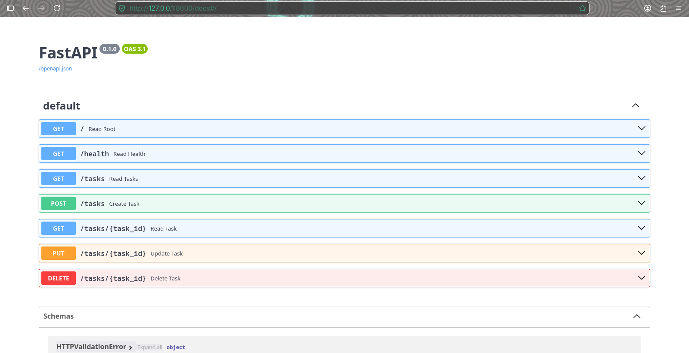

# Task API

A simple FastAPI-based task management API for creating, reading, updating, and deleting todo tasks.

## Install & Run

1. Install dependencies:

   ```bash
   pip install -r requirements.txt
   ```

2. Run the app with Uvicorn:

   ```bash
   uvicorn main:app --reload
   ```

## Endpoints

| Method | Path | Description |
| ------ | ---- | ----------- |
| GET | `/` | API info and available endpoints |
| GET | `/health` | Health check |
| GET | `/tasks` | List all tasks |
| GET | `/tasks/{task_id}` | Get a task by ID |
| POST | `/tasks` | Create a new task |
| PUT | `/tasks/{task_id}` | Update a task by ID |
| DELETE | `/tasks/{task_id}` | Delete a task by ID |

## Example `curl -i`

Request:

```bash
curl -i http://127.0.0.1:8000/tasks
```

Example response:

```http
HTTP/1.1 200 OK
date: Thu, 16 Jul 2026 14:02:43 GMT
server: uvicorn
content-length: 118
content-type: application/json

[{"id":1,"title":"Task 1","done":false},{"id":2,"title":"Task 2","done":false},{"id":3,"title":"Task 3","done":false}]
```

## Swagger UI


